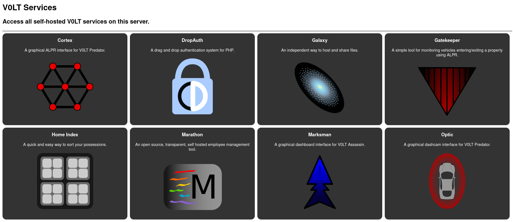

# Roadmap

A simple landing page for servers running self-hosted V0LT services.

## Description

V0LT develops a wide array of self-hosted web-services to fill a wide variety of use-cases. As such, users who install multiple of these programs may find that they have to memorize URLs, or clutter their browser with multiple bookmarks. V0LT Roadmap is a simple, minimalist, straight-forward interface that automatically detects all V0LT services installed in its parent directory, and displays quick and recognizable links to launch them.

## Screenshots

## Installation

To learn more about how to install, set up, and use Roadmap, see the [DOCUMENTATION.md](DOCUMENTATION.md) file.

## Features

### Lightweight

Roadmap is extremely lightweight and efficient, even when there are a large amount of services to display.

### Reactive

The Roadmap interface dynamically changes based on the size of the display you're viewing it from.

### Compatible

Roadmap doesn't use JavaScript of any kind, meaning it should work with practically any web browser.
